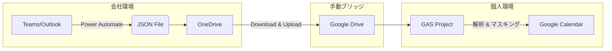

# 📅 Teams to Google Calendar Sync Tool (JSON Drop Pod)

企業のセキュリティポリシー（API制限）を回避し、Microsoft Teams (Outlook) の予定表を Google カレンダーに安全に同期するための GAS ツールです。
クラウド間の直接連携を行わず、**JSONファイルを介した「Drop Pod」方式**を採用することで、セキュアな一方向同期を実現しています。

## 🏗 アーキテクチャ



## ✨ 主な機能

* **完全な一方向同期:** 会社側のデータには一切変更を加えません。
* **ステートレス差分更新:** 外部DBを使わず、Googleカレンダーの拡張プロパティ（ハッシュ値）を利用して変更を検知します。
* **プライバシー保護:**
    * 「機密」「採用」などのキーワードを含む予定を自動でマスキング（タイトル隠蔽）。
    * 「MyAnalytics」「昼休み」などの不要な予定を自動除外。
* **HTML除去:** Outlook特有のHTML本文をプレーンテキストに変換して同期。
* **JST対応:** UTCで出力される日時データを正しく日本時間に変換。

## 📦 ディレクトリ構成

```text
.
├── src/
│   ├── Config.js          # 設定ファイル (Git除外・要作成)
│   ├── Config.sample.js   # 設定ファイルの雛形
│   ├── Main.js            # 実行エントリーポイント
│   ├── SyncEngine.js      # 同期ロジック中核
│   ├── PrivacyRules.js    # マスキングルール定義
│   ├── HashUtils.js       # 変更検知用ハッシュ生成
│   └── TextUtils.js       # テキスト加工・UTC変換
├── docs/                  # 設計書・資料
└── .clasp.json            # Clasp設定
```

## 🚀 セットアップ手順

### 1. 前提条件
* Node.js & npm がインストール済みであること
* `@google/clasp` がインストールされ、ログイン済みであること

### 2. インストール
```bash
# リポジトリのクローン
git clone https://github.com/YourName/Teams_Schedule_Sync.git
cd Teams_Schedule_Sync

# 依存関係の解決 (GASプロジェクトとの紐付け)
clasp login
clasp create --type standalone --title "Teams_Schedule_Sync" --rootDir ./src
# ※または既存の .clasp.json を配置
```

### 3. 設定ファイルの作成
`src/Config.sample.js` をコピーして `src/Config.js` を作成し、自身の環境に合わせて書き換えてください。
**※ `src/Config.js` は `.gitignore` に含まれており、GitHubにはアップロードされません。**

```javascript
const CONFIG = {
  FOLDER_ID: 'YOUR_GOOGLE_DRIVE_FOLDER_ID', // JSONを置くフォルダ
  FILE_NAME: 'schedule_sync.json',
  CALENDAR_ID: 'primary',
  SYNC_RANGE_DAYS: 30
};
```

### 4. デプロイ
```bash
clasp push
```

## 💻 運用フロー

1.  **Export:** 会社のPower Automateボタンを押し、OneDriveにJSONを出力。
2.  **Bridge:** 生成されたJSONをGoogleドライブの所定フォルダにアップロード。
3.  **Sync:** GASエディタ（またはトリガー）から `main()` 関数を実行。

## 🛡 セキュリティに関する注意
* 本ツールは `Config.js` にフォルダID等の機密情報を保持します。このファイルは絶対に公開リポジトリにコミットしないでください。
* `.gitignore` および `.claspignore` (またはrootDir設定) により、適切な除外設定がなされていることを確認してください。

## 🤖 開発体制
This project was built using an **Agent-First** approach.
* **Brain:** Google Gemini (Architecture & Logic Design)
* **Hands:** Cursor / Antigravity (Implementation & Coding)
* **Human:** Project Management & Security Review
